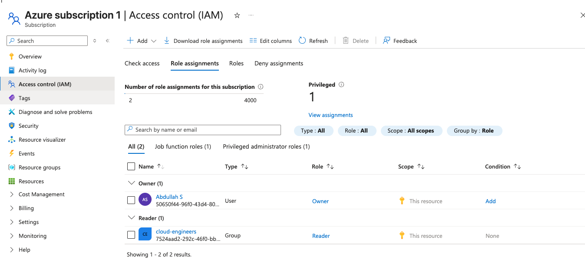

# Azure Identity Governance

## Business Problem
Most cloud breaches don't start with someone breaking through 
a firewall. They start with an overprivileged account. A company 
that lets every employee have the same level of access, or worse, 
permanent admin access, is one compromised credential away from 
a serious incident. I built this to show how you actually lock 
that down in Azure.

## What I Built
I designed and implemented an identity governance framework in 
Microsoft Entra ID using a least-privilege access model. This 
included creating users, organizing them into security groups, 
and assigning scoped RBAC roles to control what each team can 
see and do in Azure.

## What I Implemented

### Users and Groups
Created two users representing a cloud engineering team and 
organized them into a security group called cloud-engineers. 
Using groups instead of assigning roles directly to individual 
users is a best practice — it scales cleanly and makes access 
audits straightforward.

### RBAC Role Assignment
Assigned the Reader role to the cloud-engineers group at the 
Azure subscription scope. This gives the team visibility into 
all resources without the ability to create, modify, or delete 
anything. Least privilege enforced at the group level.

### Conditional Access Policy Design
Designed a Conditional Access policy to require MFA for all 
members of the cloud-engineers group accessing any cloud app. 
Full policy enforcement requires Microsoft Entra ID Premium — 
in a production environment this would be enabled and set to 
block access entirely for any sign-in that does not satisfy 
the MFA requirement.

### PIM (Privileged Identity Management)
In a production environment with Entra ID P2, I would implement 
PIM to eliminate standing admin access entirely. Instead of 
permanent role assignments, engineers would request elevated 
access for a defined time window, require manager approval, 
and have every privileged action logged for audit. This is 
the Zero Trust standard for privileged access management.

## Key Decisions

**Why assign roles to groups instead of individual users?**
Assigning roles directly to users creates an unmanageable 
mess at scale. When someone joins or leaves the team you 
change their group membership — the role assignment never 
needs to touch. It also makes access reviews clean and auditable.

**Why Reader and not Contributor?**
The principle of least privilege. A cloud engineering team 
reviewing infrastructure does not need write access. Reader 
gives them full visibility to do their job without the risk 
of accidental or malicious changes to production resources.

**Why Report-only mode for Conditional Access?**
Enabling a Conditional Access policy in enforcement mode 
without testing it first can lock legitimate users out of 
the environment. Report-only lets you validate that the 
policy targets the right users and conditions before it 
starts blocking anyone.

## Tools Used
Microsoft Entra ID
Azure RBAC
Azure Portal

## Architecture
